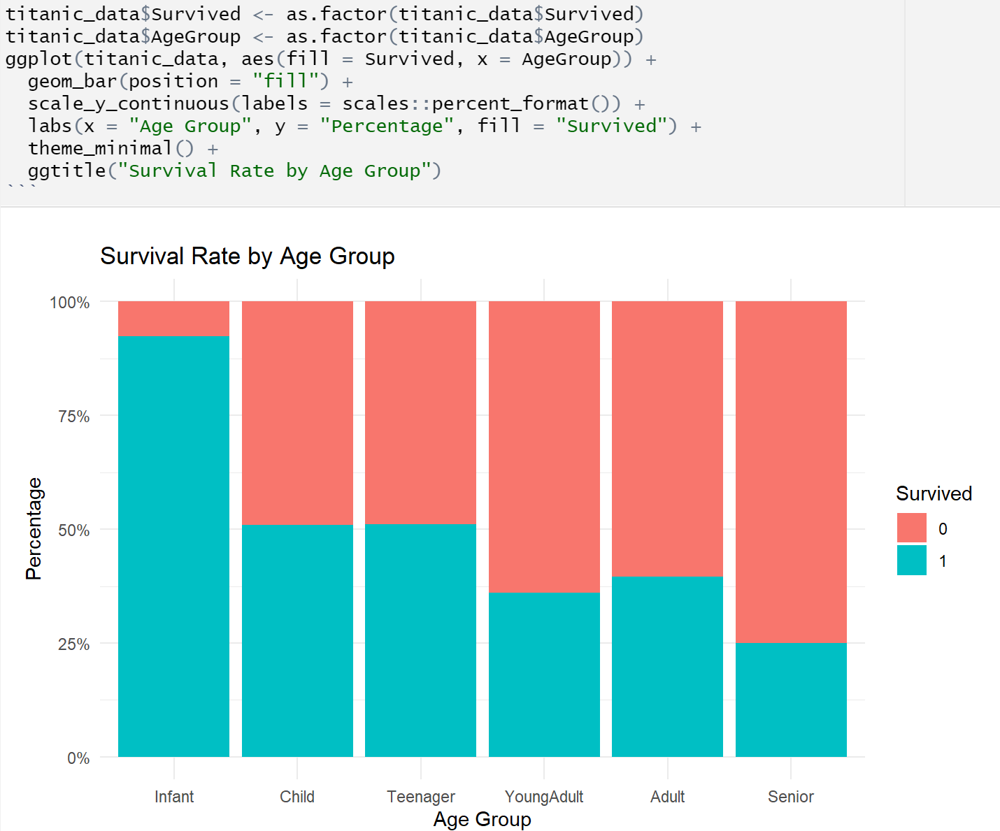

# Titanic-Survival-Prediction
This project aims to identify the key factors that contributed to survival outcomes during the infamous 1912 Titanic disaster. 

对年龄进行分类之后
```
Call:
glm(formula = Survived ~ ., family = "binomial", data = train_data)

Coefficients:
                   Estimate Std. Error z value Pr(>|z|)    
(Intercept)          7.1041     1.2301   5.775 7.69e-09 ***
`Pclass2,3`         -2.0011     0.3150  -6.353 2.11e-10 ***
Sexmale             -2.8107     0.2692 -10.442  < 2e-16 ***
AgeGroupChild       -3.8260     1.1800  -3.242 0.001185 ** 
AgeGroupTeenager    -4.0772     1.2347  -3.302 0.000960 ***
AgeGroupYoungAdult  -4.2590     1.1371  -3.746 0.000180 ***
AgeGroupAdult       -4.4784     1.1554  -3.876 0.000106 ***
AgeGroupSenior      -5.4430     1.3304  -4.091 4.29e-05 ***
SibSp               -0.3375     0.1615  -2.090 0.036631 *  
---
Signif. codes:  0 ‘***’ 0.001 ‘**’ 0.01 ‘*’ 0.05 ‘.’ 0.1 ‘ ’ 1

(Dispersion parameter for binomial family taken to be 1)

    Null deviance: 636.85  on 474  degrees of freedom
Residual deviance: 429.87  on 466  degrees of freedom
AIC: 447.87

Number of Fisher Scoring iterations: 5

Confusion Matrix and Statistics

          Reference
Prediction   0   1
         0 103  23
         1  17  60
                                          
               Accuracy : 0.803           
                 95% CI : (0.7415, 0.8553)
    No Information Rate : 0.5911          
    P-Value [Acc > NIR] : 1.077e-10       
                                          
                  Kappa : 0.5878          
                                          
 Mcnemar's Test P-Value : 0.4292          
                                          
            Sensitivity : 0.8583          
            Specificity : 0.7229          
         Pos Pred Value : 0.8175          
         Neg Pred Value : 0.7792          
             Prevalence : 0.5911          
         Detection Rate : 0.5074          
   Detection Prevalence : 0.6207          
      Balanced Accuracy : 0.7906          
                                          
       'Positive' Class : 0  
```

对年龄进行分类之前

```
Call:
glm(formula = Survived ~ ., family = "binomial", data = train_data)

Coefficients:
             Estimate Std. Error z value Pr(>|z|)    
(Intercept)  3.527633   0.512812   6.879 6.03e-12 ***
`Pclass2,3` -2.002717   0.304939  -6.568 5.11e-11 ***
Sexmale     -2.630445   0.254367 -10.341  < 2e-16 ***
Age         -0.026564   0.009358  -2.839  0.00453 ** 
SibSp       -0.270880   0.142296  -1.904  0.05696 .  
---
Signif. codes:  0 ‘***’ 0.001 ‘**’ 0.01 ‘*’ 0.05 ‘.’ 0.1 ‘ ’ 1

(Dispersion parameter for binomial family taken to be 1)

    Null deviance: 636.85  on 474  degrees of freedom
Residual deviance: 450.48  on 470  degrees of freedom
AIC: 460.48

Number of Fisher Scoring iterations: 4

Confusion Matrix and Statistics

          Reference
Prediction   0   1
         0 102  25
         1  18  58
                                          
               Accuracy : 0.7882          
                 95% CI : (0.7255, 0.8423)
    No Information Rate : 0.5911          
    P-Value [Acc > NIR] : 2.154e-09       
                                          
                  Kappa : 0.556           
                                          
 Mcnemar's Test P-Value : 0.3602          
                                          
            Sensitivity : 0.8500          
            Specificity : 0.6988          
         Pos Pred Value : 0.8031          
         Neg Pred Value : 0.7632          
             Prevalence : 0.5911          
         Detection Rate : 0.5025          
   Detection Prevalence : 0.6256          
      Balanced Accuracy : 0.7744          
                                          
       'Positive' Class : 0   
```

