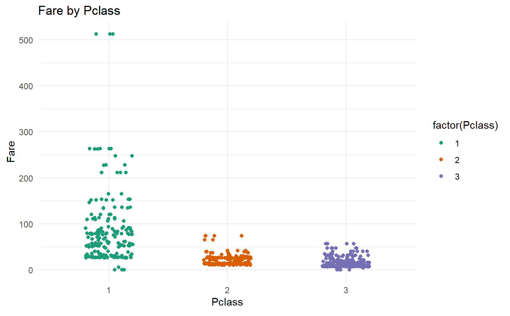

# 泰坦尼克号乘客生存预测模型

泰坦尼克号于1912年4月15日处女航时与冰山相撞下沉，是历史上最著名的海难事故之一。这起事故中，2224名乘客和1502名船员不幸遇难。尽管生存是否幸运可能参差不齐，一些研究似乎表明，某些群体比其他群体生存的可能性更高。本文将利用泰坦尼克号生还乘客的部分个人数据，对此展开详细的分析。

## 数据预处理

### 1. 预览数据结构

```r
# 读取数据
titanic_data <- read.csv('titanic.csv')
# 查看数据结构
str(titanic_data)
```
```
'data.frame':	891 obs. of  12 variables:
 $ PassengerId: int  1 2 3 4 5 6 7 8 9 10 ...
 $ Survived   : int  0 1 1 1 0 0 0 0 1 1 ...
 $ Pclass     : int  3 1 3 1 3 3 1 3 3 2 ...
 $ Name       : chr  "Braund, Mr. Owen Harris" "Cumings, Mrs. John Bradley (Florence Briggs Thayer)" "Heikkinen, Miss. Laina" "Futrelle, Mrs. Jacques Heath (Lily May Peel)" ...
 $ Sex        : chr  "male" "female" "female" "female" ...
 $ Age        : num  22 38 26 35 35 NA 54 2 27 14 ...
 $ SibSp      : int  1 1 0 1 0 0 0 3 0 1 ...
 $ Parch      : int  0 0 0 0 0 0 0 1 2 0 ...
 $ Ticket     : chr  "A/5 21171" "PC 17599" "STON/O2. 3101282" "113803" ...
 $ Fare       : num  7.25 71.28 7.92 53.1 8.05 ...
 $ Cabin      : chr  "" "C85" "" "C123" ...
 $ Embarked   : chr  "S" "C" "S" "S" ...
```
### 2. 处理NA
```r
# 查看每列中 NA 的个数 (MARGIN = 2: 按列方向进行计算,返回每一列的计算结果)
na_count <- apply(titanic_data, 2, function(x) sum(is.na(x)))
na_count
```


<div style="page-break-after:always"></div>

```r
# 直接把 NA 剔除
titanic_data <- na.omit(titanic_data)
str(titanic_data)
```
```
'data.frame':	714 obs. of  12 variables:
 $ PassengerId: int  1 2 3 4 5 7 8 9 10 11 ...
 $ Survived   : int  0 1 1 1 0 0 0 1 1 1 ...
 $ Pclass     : int  3 1 3 1 3 1 3 3 2 3 ...
 $ Name       : chr  "Braund, Mr. Owen Harris" "Cumings, Mrs. John Bradley (Florence Briggs Thayer)" "Heikkinen, Miss. Laina" "Futrelle, Mrs. Jacques Heath (Lily May Peel)" ...
 $ Sex        : chr  "male" "female" "female" "female" ...
 $ Age        : num  22 38 26 35 35 54 2 27 14 4 ...
 $ SibSp      : int  1 1 0 1 0 0 3 0 1 1 ...
 $ Parch      : int  0 0 0 0 0 0 1 2 0 1 ...
 $ Ticket     : chr  "A/5 21171" "PC 17599" "STON/O2. 3101282" "113803" ...
 $ Fare       : num  7.25 71.28 7.92 53.1 8.05 ...
 $ Cabin      : chr  "" "C85" "" "C123" ...
 $ Embarked   : chr  "S" "C" "S" "S" ...
 - attr(*, "na.action")= 'omit' Named int [1:177] 6 18 20 27 29 30 32 33 37 43 ...
  ..- attr(*, "names")= chr [1:177] "6" "18" "20" "27" ...
```
### 3. 处理空字符串
从str中可以明显的观察到，除了NA之外还有空字符串。
```r
# 统计空字符串和 NA 的函数
empty_count <- function(x) {
  
  na_count <- sum(is.na(x))
  empty_count <- sum(x == "")
  
  c(na_count, empty_count)
}

# 对每列应用这个函数
counts <- apply(titanic_data, 2, empty_count)
counts
```

现在 NA 确实处理完了, Cabin 缺失 529 个, 超过 80% 的值为空值, 即使填充也很难转换为有意义的特征, 所以直接删掉。
Embarked只有少量空字符串, 可以考虑填补众数或删除行, 这里先删除了。Name 和 Ticket 这两个特征包含太多独特的字符串值, 直接删除可以减少模型复杂度。
```r
# 删除Cabin列
titanic_data <- subset(titanic_data, select=-c(Cabin))
# 删除Embarked为空的行  
titanic_data <- titanic_data[titanic_data$Embarked != "",]
# 删除Name列
titanic_data <- subset(titanic_data, select=-c(Name)) 
# 删除Ticket列
titanic_data <- subset(titanic_data, select=-c(Ticket))
```
### 4. 变量类型转换
Sex(性别)、Embarked(登船地点)需要转换为分类。
Pclass(船舱等级)被当成了数字特征处理, 但其实它应该是一个分类特征。Pclass这个特征虽然用1,2,3表示等级, 但实际上等级之间并不存在数值上的大小关系。
```r
# Pclass
titanic_data$Pclass <- as.factor(titanic_data$Pclass) 
# Sex
titanic_data$Sex <- as.factor(titanic_data$Sex)
# Embarked
titanic_data$Embarked <- as.factor(titanic_data$Embarked)
# 排除passengerId
summary(titanic_data[, -1])
```

初步观察得到原始数据中的Age列存在一个异常值0.42, 需要进行处理。

<div style="page-break-after:always"></div>

### 5. 异常值处理
笔者一开始认为小数点是错误输入，但是打印了全部信息后发现，这些小数有很多重复，而且都是`1/12`的倍数，说明这些信息是按照月份录入的。
```r
ages <- titanic_data$Age
decimal_ages <- ages[grepl("\\.", as.character(ages))]

decimal_ages
```
在第一次建模的过程中，笔者认为统计年龄的方式不同会对年龄数据有所影响，因此删除了所有含有小数的行。但是后续打印出这些行的内容之后发现，很多数据是婴儿，且他们全部存活了，如果直接删去这些行会失去对这一信息的感知，因此将这些数据保留了。事实证明获得了更好的模型，详见[commit记录](https://github.com/wukef2425/Titanic-Survival-Prediction)。


<div style="page-break-after:always"></div>

## 数据分析
### 1. 数值变量
通过箱线图试图剔除一些离群点，但观察到Fare的离群点特别多。票价确实可能会有很大的变化，票价差异可能反映了不同的舱位和服务等级。如果存在一些非常高价的票，它们可能会导致正偏态分布，从而产生较多的上端离群点。

所以接下来笔者对Fare进行了进一步的处理。首先查看票价分布：


<div style="page-break-after:always"></div>

联想到票价可能与船舱等级有很大的联系，因此笔者试图了解不同等级船舱对票价分布的贡献：

查看不同等级船舱票价的离群点：


<div style="page-break-after:always"></div>


### 2. 分类变量
首先查看了分类变量的分布：


接下来使用ANOVA检验Pclass与Fare之间的差异：
```r
# 使用ANOVA检验Pclass与Fare之间的差异
anova_result <- aov(Fare ~ as.factor(Pclass), data = titanic_data)
summary(anova_result)
# 运行Tukey's HSD事后检验
tukey_result <- TukeyHSD(anova_result)
# 显示事后检验结果
print(tukey_result)
```

从这个结果中确实可以看出，Pclass可以很好地解释Fare价格的变异。但是一等舱定价显著高于二三等舱，二三等舱定价相对而言没有明显差异。因此考虑将二三等舱合并，同时Fare和Pclass应该只能选取其中之一入模，考虑到在数值变量分析时Fare呈现出的不确定性，初次建模选择了Pclass。

<div style="page-break-after:always"></div>

## 数据建模
### 1. 初次尝试
```r
original_survived_column <- titanic_data$Survived
# 独热编码
titanic_data <- model.matrix(~ Pclass + Sex + AgeGroup + SibSp, data = titanic_data)
# 删除第一列（避免虚拟变量陷阱）
titanic_data <- titanic_data[, -1]
titanic_data <- as.data.frame(titanic_data)
# 将原始的 Survived 列加回去
titanic_data$Survived <- original_survived_column

# 拆分数据集
library(caret)
set.seed(123)
split_index <- createDataPartition(titanic_data$Survived, p = 0.7, list = FALSE)
train_data <- titanic_data[split_index, ]
test_data <- titanic_data[-split_index, ]

str(train_data)
```
使用 `model.matrix()` 函数对分类变量进行独热编码。这个函数会自动为分类变量的每个级别创建一个新的列。删除独热编码后的数据矩阵的第一列，以防止模型中的多重共线性。

通过查看模型的摘要`summary(model)`，决定移除不显著的变量。不管是手动移除还是使用`stepAIC`都发现包含`Pclass`、`Sex`、`Age` 和 `SibSp` 的模型是最佳的。

<div style="page-break-after:always"></div>

### 2. 从数据上优化
正如之前提到的`Age`的小数问题，笔者发现删除含有小数Age的行反而会使模型变差，就重新查看了那些行，发现了`1/12`的规律，给年龄分类之后模型变的更好了。

### 3. 模型分析
所有变量的P值均小于0.05，意味着在5%的显著性水平上，这些变量与存活结果是统计显著相关的。星号的数量表示了不同级别的显著性，其中三个星号表示极其显著（P < 0.001），两个星号表示非常显著（P < 0.01），一个星号表示显著（P < 0.05）。
- **Pclass2,3 (船舱等级)**: 船舱等级不是最高等级（即2等舱或3等舱）的个体，存活的对数几率会显著降低。系数为-2.0011，表示相对于参考类别（1等舱），属于2等舱或3等舱的乘客存活几率较低。

- **Sexmale (性别为男)**: 性别为男性的个体，存活的对数几率显著降低。系数为-2.8107，说明男性的存活率显著低于女性（参考类别）。

- **Age Groups (年龄组)**: 所有的年龄组变量（Child, Teenager, YoungAdult, Adult, Senior）的系数都是负数，并且统计上显著，表明随着年龄的增长，存活的对数几率降低，与分布显示一致。
 

- **SibSp (兄弟姐妹/配偶数量)**: 此系数为-0.3375，指在其他条件相同的情况下，乘客每多一个兄弟姐妹或配偶，存活的对数几率略微降低。

总结来说，这个模型显示，船舱等级、性别、年龄组和有兄弟姐妹/配偶的数量是影响存活几率的显著因素。其中性别和船舱等级是最强的预测因素，男性和低等舱乘客的存活率显著低于其他人。

### 4. 结论
根据上述分析结果，我们可以总结出在泰坦尼克号数据集中，以下类型的人更有可能存活下来：

1. **船舱等级**：一等舱的乘客存活率高于二等舱和三等舱的乘客。这可能是因为一等舱的乘客在船上有更好的位置和更快的逃生渠道。

2. **性别**：女性乘客比男性乘客有更高的存活率。这可能是因为在紧急疏散时，"妇女和儿童先行"。

3. **年龄组**：较年轻的乘客（特别是儿童）相比于成年人和老年人有更高的存活几率。这也可能反映了救援过程中儿童被优先考虑。

4. **家庭关系**：那些没有或者有较少兄弟姐妹/配偶同行的乘客存活率更高。这可能是因为独自一人或者负担较轻的乘客在逃生时行动更为迅速灵活。

结合所有这些因素，可以得出结论，一等舱的年轻女性乘客，特别是那些没有携带多个家庭成员（兄弟姐妹/配偶）的人，在泰坦尼克号事故中存活的可能性更大。

这些发现与当时的社会规范和船上的紧急情况处理方式相一致，其中特权阶层（如一等舱乘客）和弱势群体（如妇女和儿童）在灾难中得到了更多的关注和优先救援。

## 模型质量评估


混淆矩阵对角线(左上到右下)上显示较深的颜色，而非对角线上的颜色较浅，ROC曲线靠近左侧和上侧边缘，AUC=0.855接近1，表明模型具有良好的区分能力。